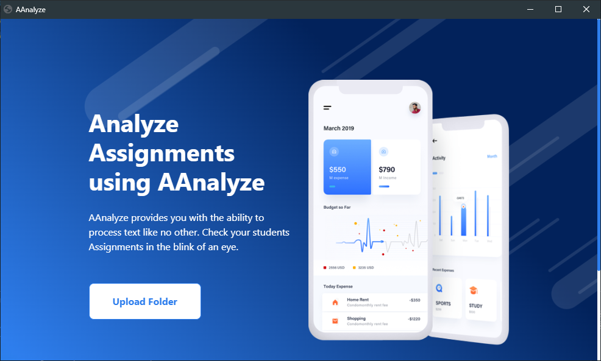
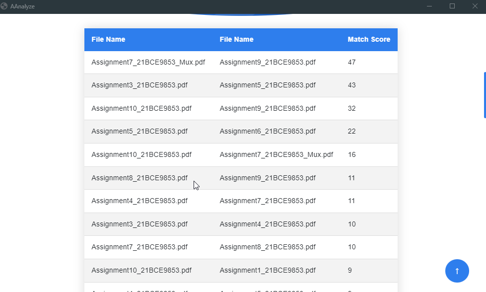

[](https://repl.it/github/Sarath191181208/plagarism_checker)

# Plagarism Checker

Checks the similarity of files currently supports text files, PDF files.

# Description

How nice it would be if people learned, stopped copying each others work, feeding on others. This is an Utopian dream. People can even do this unknowingly therfore, we need some kind of system to stop them from copying. This is a simple checker for the above mentioned problem. Feed it the folder containing the files you want to check. Vectorizing the words and checking the consine similarity between them this system gives a score aganist each other file. Using this score you can check if the two assignments are truly similar.

## Demo





## Features

- Scoring each other file in a given folder

## Run Locally for development

Clone the project

```bash
  git clone https://github.com/Sarath191181208/plagarism_checker
```

Go to the project directory

```bash
  cd ./plagarism_checker
```

Install dependencies

```bash
  pip3 install -r requirements.txt
```

Run the project Locally

```bash
  python main.py
```

Converting into exe

Use auto-py-to-exe to convert python file to exe
./dev-build.json contians the configuration for the app you must change some settings feel free to contact me for any help.

## Further Work

- [ ] Increasing the text analysis capabilities.
- [ ] Supporting other files like docs, docx.
- [ ] Adding an open button when clicked on the file.
- [ ] Some kind of easier chart to visualize.

## Requirements

- python `Make sure to add to path`
- tkinter `default`
- PyPDF2 `pip3 install PyPDF2`
- eel `pip3 install eel`
- scikit-learn `pip3 install scikit-learn`

## Authors

- [Sarath](https://www.github.com/https://github.com/Sarath191181208)
